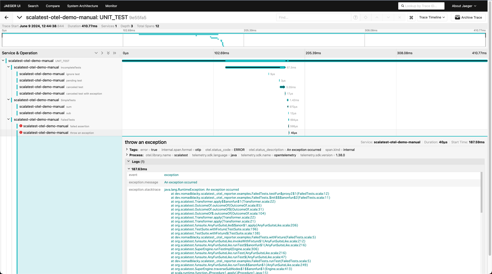

# ScalaTest OpenTelemetry Reporter

[ScalaTest](https://www.scalatest.org/) extension that instruments your tests with [OpenTelemetry](https://opentelemetry.io/).

## Getting Started

This example demonstrates how to send trace data to [Jaeger](https://www.jaegertracing.io/) in localhost.

Before you start, you need to run Jaeger in a Docker container.

```yaml
services:
  jeager:
    image: jaegertracing/all-in-one:latest
    ports:
      - "4317:4317"
      - "16686:16686"
```

```shell
docker compose up -d
```

Add the following configuration to your `build.sbt`.

```scala
lazy val `my-project` = (project in file("my-project"))
  .settings(
    // Add dependencies
    libraryDependencies ++= Seq(
      "org.scalatest"           %% "scalatest"                   % "3.2.18"       % Test,
      "io.opentelemetry"         % "opentelemetry-sdk"           % "1.38.0"       % Test,
      "io.opentelemetry"         % "opentelemetry-exporter-otlp" % "1.38.0"       % Test,
      "io.opentelemetry.semconv" % "opentelemetry-semconv"       % "1.21.0-alpha" % Test,
      "dev.nomadblacky"         %% "scalatest-otel-reporter"     % "0.2.0-alpha"  % Test,
    ),
    // Add the reporter class
    Test / testOptions += Tests.Argument(
      TestFrameworks.ScalaTest,
      "-C",
      "example.JaegerTestReporter",
    ),
  )
```

Create a reporter class that extends `OpenTelemetryTestReporter` and implements the `otel` method.  
Below is an example of sending trace data to Jaeger in localhost.

```scala
package example

import dev.nomadblacky.scalatest_otel_reporter.OpenTelemetryTestReporter
import io.opentelemetry.api.OpenTelemetry
import io.opentelemetry.api.common.Attributes
import io.opentelemetry.exporter.otlp.trace.OtlpGrpcSpanExporter
import io.opentelemetry.sdk.OpenTelemetrySdk
import io.opentelemetry.sdk.resources.Resource
import io.opentelemetry.sdk.trace.SdkTracerProvider
import io.opentelemetry.sdk.trace.`export`.BatchSpanProcessor
import io.opentelemetry.semconv.ResourceAttributes

import java.util.concurrent.TimeUnit

// Mix-In OpenTelemetryTestReporter
class JaegerTestReporter extends OpenTelemetryTestReporter {
  def otel: OpenTelemetry = {
    // Direct trace data to Jaeger on localhost
    val jaegerOtlpExporter =
      OtlpGrpcSpanExporter.builder.setEndpoint("http://localhost:4317").setTimeout(30, TimeUnit.SECONDS).build

    // Configure the service name (recommended)
    val serviceNameResource =
      Resource.create(Attributes.of(ResourceAttributes.SERVICE_NAME, "scalatest-otel-demo-manual"))

    // Configure the SpanProcessor
    val tracerProvider = SdkTracerProvider.builder
      .addSpanProcessor(BatchSpanProcessor.builder(jaegerOtlpExporter).build)
      .setResource(Resource.getDefault.merge(serviceNameResource))
      .build

    // Return OpenTelemetry instance
    OpenTelemetrySdk.builder.setTracerProvider(tracerProvider).build
  }
}
```

Implement the test as usual.

```scala
package example

import org.scalatest.funsuite.AnyFunSuiteLike

class SimpleTests extends AnyFunSuiteLike {
  test("sum") {
    assert(1 + 1 == 2)
  }
  test("sub") {
    assert(1 - 1 == 0)
  }
}

class FailedTests extends AnyFunSuiteLike {
  test("failed assertion") {
    assert(1 + 1 == 3)
  }
  test("throw an exception") {
    throw new RuntimeException("An exception occurred")
  }
}
// ...
```

Execute the test in the sbt shell.

```shell
sbt
> my-project/test
```

Open the Jaeger UI in your browser (http://localhost:16686/) and you will see the trace data.



